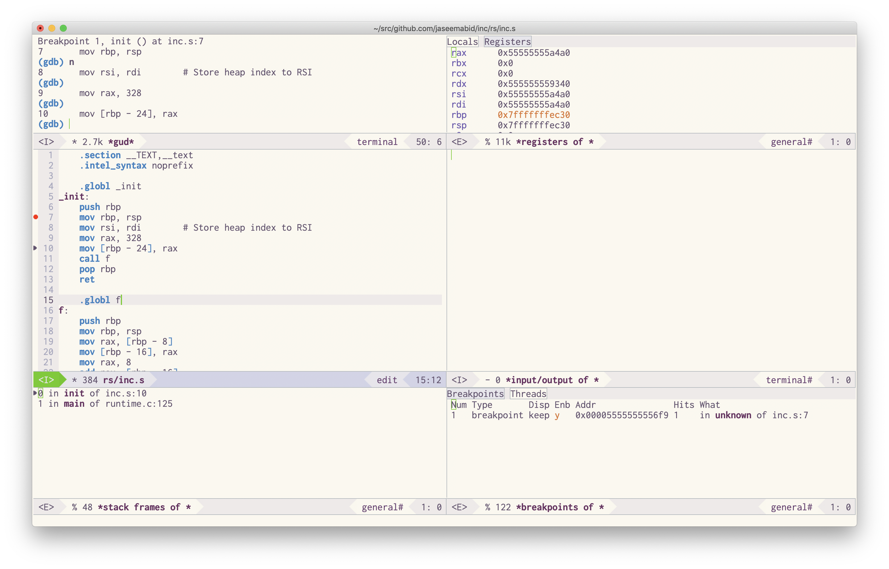

# An incremental scheme compiler [](https://travis-ci.org/jaseemabid/inc)

A tiny scheme to x86 asm compiler developed incrementally as described in the
paper [An Incremental Approach to Compiler Construction][paper] by Abdulaziz
Ghuloum.

## Getting started

    $ cargo build
    $ cargo test
    $ echo "(let ((a 1) (b 2)) (+ a b))" | cargo run -q

The generated assembly is usually easy to read

    $ echo "(let ((a 1) (b 2)) (+ a b))" | cargo run -q -- -S

## Usage

```txt
$ inc -h

Usage: ./inc [options]

Options:
    -o FILE             Output file name
    -S                  Print generated asm
    -p                  Print parse tree
    -P                  Dump raw parse tree
    -h, --help          print this help menu
```

## Docs

Inc is reasonably well documented and is preferably read with Cargo docs.

    $ cargo doc --document-private-items --open

- ℹ x86 module documentation contains links to a few good x86 tutorials.
- ℹ [How to C in 2016](https://matt.sh/howto-c) is a pretty good C refresher.
- ℹ [The Rust Programming language][book] book is a goods place to start
  learning rust. This project also uses a lot of iterators, so [Effectively
  Using Iterators In Rust][iter] might be useful as well

## Debugging with GDB

GDB doesn't work on OSX despite the several dozens of blogs that claim otherwise
and this project would be impossible without gdb. There is no easier way to
understand generated assembly. It is easier to setup remote debugging with
docker than fight code signing on osx.

Build the image

    $ docker build . -t inc:latest

Run the container in privileged mode and expose a port

    $ docker run --rm -it --privileged -p 8080:8080 inc

Run the program you want to debug in the container and build the executable

    /inc# echo '(let ((f (lambda (x) (+ x 1)))) (f 41))' | cargo run -q inc

Start a remote debugging session

    /inc# gdbserver 127.0.0.1:8080 ./inc

Start GDB on the host machine with the custom `.gdbinit` file

    $ cat .gdbinit

    set startup-with-shell off
    target remote 127.0.0.1:8080

This should work with the CLI as well as Emacs

    $ gdb

    Reading /inc/inc from remote target...
    warning: File transfers from remote targets can be slow. Use "set sysroot" to access files locally instead.
    Reading /inc/inc from remote target...
    Reading symbols from target:/inc/inc...
    Reading /lib64/ld-linux-x86-64.so.2 from remote target...
    Reading /lib64/ld-linux-x86-64.so.2 from remote target...
    Reading /lib64/5dfd7b95be4ba386fd71080accae8c0732b711.debug from remote target...
    Reading /lib64/.debug/5dfd7b95be4ba386fd71080accae8c0732b711.debug from remote target...
    Reading /usr/local/Cellar/gdb/8.3/lib/debug//lib64/5dfd7b95be4ba386fd71080accae8c0732b711.debug from remote target...
    Reading /usr/local/Cellar/gdb/8.3/lib/debug/lib64//5dfd7b95be4ba386fd71080accae8c0732b711.debug from remote target...
    Reading target:/usr/local/Cellar/gdb/8.3/lib/debug/lib64//5dfd7b95be4ba386fd71080accae8c0732b711.debug from remote target...
    0x00007ffff7fd6090 in ?? () from target:/lib64/ld-linux-x86-64.so.2
    (gdb)



## Colophon

This project started in [Chez] but, I [ported it to Racket][rkt] and then again
to [rust]. The old project still lives at [rkt](./rkt).

[Chez]:  https://www.scheme.com
[paper]: docs/paper.pdf?raw=true
[rkt]:   https://github.com/jaseemabid/inc/commit/a8ab1e6c7506023e59ddcf11cfabe53fbaa5c00a
[rust]:  https://github.com/jaseemabid/inc/commit/cc333332a5f20dc9de168954808d363621bd0c97
[iter]:  https://hermanradtke.com/2015/06/22/effectively-using-iterators-in-rust.html
[book]:  https://doc.rust-lang.org/book/#the-rust-programming-language
